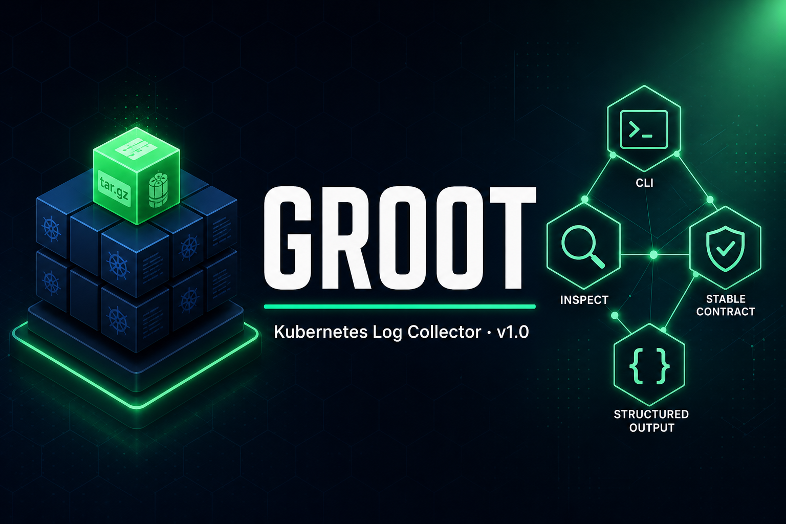

# GROOT — Kubernetes diagnostics CLI

<a id="readme-top"></a>

**☸** _Collect cluster diagnostics into one archive_

[](https://github.com/hrodrig/groot/releases)
[](#)
[](https://go.dev/)
[](./LICENSE)
[](https://github.com/hrodrig/groot/actions/workflows/ci.yml)
[](https://goreportcard.com/report/github.com/hrodrig/groot)

**Repo:** [github.com/hrodrig/groot](https://github.com/hrodrig/groot) · **Releases:** [GitHub Releases](https://github.com/hrodrig/groot/releases)

<p align="center">
  
</p>

GROOT is a Go CLI (Cobra + Viper) that collects broad Kubernetes diagnostics, including worker/node details, control plane logs, namespace resources, pod logs, and events.

[↑ Back to top](#readme-top)

## Table of contents

- [Features](#features)
- [Requirements](#requirements)
- [Quick start](#quick-start)
- [First run](#first-run)
- [Usage examples](#usage-examples)
- [Config](#config)
- [Resolution and precedence](#resolution-and-precedence)
- [Output naming](#output-naming)
- [Console output modes](#console-output-modes)
- [Typical collected data](#typical-collected-data)
- [Notifications](#notifications)
- [Rootless container](#rootless-container)
- [Security note](#security-note)
- [Get involved](#get-involved)

[↑ Back to top](#readme-top)

## Features

- Cobra CLI with `collect` command
- Viper YAML config + environment variable override
- Concurrent `kubectl` execution for faster collection
- Worker/node and control plane oriented log gathering
- Output folder + `.tar.gz` archive generation
- Optional notifications (Slack, Discord, Teams, PagerDuty, Telegram, generic webhooks)
- Rootless container image support

[↑ Back to top](#readme-top)

## Requirements

- Go 1.26+
- `kubectl` configured against target cluster
- RBAC permissions to read logs/resources

[↑ Back to top](#readme-top)

## Quick start

```bash
make build
./bin/groot --print-sample-config > groot.yml
# Edit groot.yml: replace sample values with your cluster settings (namespaces, targets,
# kubeconfig, output paths, optional notify webhooks/tokens) before collecting.
./bin/groot collect
```

Useful runtime flags (global or with `collect`):

- `--version` prints version, commit, branch, and build date
- `--test-connection` validates Kubernetes connectivity and exits
- `--verbose` shows each executed command as `CMD`, plus `OK`/`ERR` results
- `--quiet` suppresses normal **console** output (INFO/WARN/CMD/OK) and only prints errors; **notify integrations still run** (Slack, Discord, Teams, PagerDuty, Telegram, generic) unless you disable them in config or use `--no-notify`
- `--no-notify` skips all notifications after a successful collect (useful for cron when you only want the archive). Same effect as env `GROOT_NO_NOTIFY=1` (or `true` / `yes`, case-insensitive)
- `--no-color` disables ANSI colors
- `--message "label text"` appends a sanitized suffix to archive and capture-related output names
- `--kubeconfig /path/to/config` overrides kubeconfig from file/env

[↑ Back to top](#readme-top)

## First run

If you do not have a config file yet, print a sample and save it:

```bash
./bin/groot --print-sample-config > groot.yml
```

The generated file is a **template only**. Open `groot.yml` and set **your own** values for your environment—for example `kubeconfig` (if not using the default), `collection.namespaces`, workloads under `collection.targets` (deployments, StatefulSets, DaemonSets, Helm releases), `output_dir` / `file_prefix`, and any `notify.*` URLs or secrets. Until you do, the sample names and disabled notification blocks will not match a real cluster.

Then run:

```bash
./bin/groot collect
```

Default config discovery order (when `--config` is not provided):

1. `./groot.yml`
2. `~/.groot/groot.yml`
3. built-in defaults and `GROOT_*` environment variables

You can always override file discovery with `--config` (see [Usage examples](#usage-examples)).

[↑ Back to top](#readme-top)

## Usage examples

Paths below use `./bin/groot` after `make build`; if you used `make install`, use the `groot` binary from your `PATH` the same way (for example `groot collect ...`).

### Use a specific config file

Only `./groot.yml` and `~/.groot/groot.yml` are discovered automatically. Any other filename **must** be passed explicitly:

```bash
./bin/groot collect --config /path/to/my-groot.yml
./bin/groot collect --config ./groot-mi-test.yml
```

From the repository root, after editing your copy:

```bash
./bin/groot collect --config groot-mi-test.yml
```

### Check Kubernetes access and config (no collection)

```bash
./bin/groot --config ./groot-mi-test.yml --test-connection
./bin/groot collect --config ./groot-mi-test.yml --test-connection
```

### Cron: quiet console, no outbound notifications

Console only (Slack/Discord/etc. still run if enabled in YAML):

```bash
./bin/groot collect --config /path/to/groot.yml --quiet
```

Skip **all** notify channels for this run (archive still created); same as env `GROOT_NO_NOTIFY=1` / `true` / `yes`:

```bash
./bin/groot collect --config /path/to/groot.yml --quiet --no-notify
0 * * * * GROOT_NO_NOTIFY=1 /usr/local/bin/groot collect --config /home/you/.groot/prod.yml --quiet
```

### Custom capture label (`--message`)

```bash
./bin/groot collect --config groot.yml --message "staging-network-audit-2026-04-28"
```

### Override kubeconfig for one run

```bash
./bin/groot collect --config groot.yml --kubeconfig /path/to/other-kubeconfig
```

[↑ Back to top](#readme-top)

## Config

Edit `groot.yml` (or any file passed with `--config`) and align every section with your cluster and operational needs. Do not rely on the shipped sample as a drop-in configuration.

Sample config (same as `groot --print-sample-config` and `configs/config.yaml` in the repo):

```yaml
kubeconfig: ""
output_dir: "./out"
file_prefix: "groot-capture"

collection:
  timeout: 20m
  worker_concurrency: 6
  namespaces:
    - kube-system
    - default
  targets:
    default:
      deployments:
        - api
      statefulsets:
        - redis
      daemonsets:
        - node-agent
      helm_releases:
        - my-release
  include_pod_logs: true
  include_previous_logs: true
  pod_log_tail_lines: 1500
  include_node_details: true
  extra_kubectl:
    - "get componentstatuses"
    - "get csr"

notify:
  slack:
    enabled: false
    # One URL, or several separated by ';' (e.g. team A; team B webhooks)
    webhook_url: ""

  discord:
    enabled: false
    # Discord server Settings → Integrations → Webhooks (same ';' for multiple URLs)
    webhook_url: ""

  teams:
    enabled: false
    # Same ';' convention as Slack for multiple Teams incoming webhooks
    webhook_url: ""

  pagerduty:
    enabled: false
    # Events API v2 integration key(s); multiple keys separated by ';'
    routing_key: ""
    severity: "warning"
    source: "groot"

  telegram:
    enabled: false
    token: ""
    # One chat id, or several (group/user) ids separated by ';' with the same bot
    chat_id: ""

  generic:
    enabled: false
    # POST JSON with one root string field only: {"<json_key>":"<summary>"} (see README → Notifications).
    webhook_url: ""
    json_key: "text"
    headers: {}
```

Environment variables use the `GROOT_` prefix (Viper). Nested YAML keys map to env names by replacing `.` with `_` (for example `collection.timeout` → `GROOT_COLLECTION_TIMEOUT`). `kubeconfig` in YAML still loses to the process `KUBECONFIG` env when that is set (see [Resolution and precedence](#resolution-and-precedence)).

Common examples:

- `GROOT_OUTPUT_DIR`, `GROOT_FILE_PREFIX`
- `GROOT_COLLECTION_TIMEOUT`, `GROOT_COLLECTION_WORKER_CONCURRENCY`, `GROOT_COLLECTION_INCLUDE_POD_LOGS` (boolean), `GROOT_COLLECTION_POD_LOG_TAIL_LINES`, …
- Notify secrets (also read when `enabled: true` and the YAML field is empty): `GROOT_NOTIFY_SLACK_WEBHOOK_URL`, `GROOT_NOTIFY_DISCORD_WEBHOOK_URL`, `GROOT_NOTIFY_TEAMS_WEBHOOK_URL`, `GROOT_NOTIFY_TELEGRAM_TOKEN`, `GROOT_NOTIFY_TELEGRAM_CHAT_ID`, `GROOT_NOTIFY_GENERIC_WEBHOOK_URL`, `GROOT_NOTIFY_PAGERDUTY_ROUTING_KEY`
- `GROOT_NO_NOTIFY=1` (or `true` / `yes`): same as `--no-notify` for a run

**`collection.extra_kubectl`:** Each string is split on whitespace and passed as additional `kubectl` arguments (no shell). At load time, Groot only accepts **read-oriented** subcommands: `get`, `describe`, `explain`, `top`, `logs`, `api-resources`, `api-versions`, `version`, `cluster-info`, `wait`, plus `config view …` and `auth can-i …`. Anything else fails `collect` immediately with a configuration error so a typo or copy-paste cannot turn extras into destructive verbs (`delete`, `exec`, `apply`, etc.).

When a notification channel is enabled and required credentials are missing, `groot` fails fast with a clear configuration error.

[↑ Back to top](#readme-top)

## Resolution and precedence

Configuration file precedence:

1. `--config` explicit path
2. `./groot.yml`
3. `~/.groot/groot.yml`
4. defaults

`kubeconfig` precedence:

1. `--kubeconfig /path/to/config`
2. `KUBECONFIG`
3. `kubeconfig` value in YAML
4. if all empty, `kubectl` default behavior

Workload filter behavior (`collection.targets`):

- per namespace, you can define `deployments`, `statefulsets`, `daemonsets`, and `helm_releases`
- if a namespace has targets, pod logs for that namespace are limited to those workloads
- if a namespace has no targets, pod logs keep the default broad behavior
- `helm_releases` matches `app.kubernetes.io/instance`

`pod_log_tail_lines` behavior:

- `0`: collect full logs (no `--tail`; use when you need the entire log stream)
- `>0`: collect only the last N lines per pod
- applies to both current and `--previous` pod logs

`include_previous_logs` behavior:

- `true`: also collects `kubectl logs --previous` per pod into `*.previous.log`
- `false`: collects only current pod logs

`output_dir` path expansion:

- supports `~` (home directory), for example `~/tmp/groot-out`
- supports environment variables, for example `${HOME}/tmp/groot-out`

[↑ Back to top](#readme-top)

## Output naming

Capture output names are:

- directory: `<timestamp>`
- archive: `<timestamp>-<cluster>[-<message>].tar.gz`

`--message` is sanitized before use:

- lowercase
- trims leading/trailing spaces
- removes accents/diacritics
- converts spaces and `_` to `-`
- removes unsupported filesystem characters
- collapses repeated dashes

Example:

- input: `--message "network routing issue"`
- suffix: `network-routing-issue`
- output: `20260428-123200-my-cluster-network-routing-issue.tar.gz`

Directory layout:

- `nodes/`
- `extras/`
- one directory per configured namespace (for example `kube-system/`, `default/`)
- pod log files: `<pod>__<node>.log` (and `.previous.log` when enabled), same pattern for control-plane pods under `kube-system/`
- after archive creation, the timestamp directory is automatically removed

Inside the `.tar.gz`, every path is prefixed with the capture folder name (`<timestamp>/…`, for example `20260502-174207/kube-system/…`). Extracting into a shared directory (for example `~/tmp/groot-out`) keeps each run under its own subdirectory instead of mixing `kube-system/`, `cloudbridge/`, etc. at the extraction root. Archives produced by older Groot versions may still have a flat layout at the tar root.

[↑ Back to top](#readme-top)

## Console output modes

- default: summary `INFO` lines
- `--verbose`: adds per-command `CMD` / `OK` / `ERR`
- `--quiet`: suppresses normal **console** output, prints only errors; does **not** disable webhooks/API notifications
- `--no-notify`: skips every notify channel for this run (config can still have `enabled: true`; use from cron when you want silence to external systems). Env equivalent: `GROOT_NO_NOTIFY=1`
- `--no-color`: disables ANSI colors

[↑ Back to top](#readme-top)

## Typical collected data

- `kubectl cluster-info`
- `kubectl get nodes -o wide`
- `kubectl get pods -A -o wide`
- `kubectl get events -A`
- `kubectl describe node <node>`
- `kubectl top node <node>`
- `kubectl logs -n <ns> <pod> --all-containers` → files named `<pod>__<node>.log` under each namespace directory (pending/unscheduled pods use `unknown-node`)
- Control plane pod logs in `kube-system` (`tier=control-plane`, when available) use the same `<pod>__<node>.log` pattern
- `extras/kubeconfig.txt` derived from kubeconfig (`context`, `cluster`, `user`, `server`)

[↑ Back to top](#readme-top)

## Notifications

Enable each channel in config:

- Slack Incoming Webhook (`notify.slack.webhook_url` or `GROOT_NOTIFY_SLACK_WEBHOOK_URL`). For multiple channels, put several full webhook URLs on the same value separated by `;` (spaces optional); Groot notifies each URL in order and reports combined errors if any request fails.
- **Discord** Incoming Webhook (`notify.discord.webhook_url` or `GROOT_NOTIFY_DISCORD_WEBHOOK_URL`): same `;`-separated URL list. Payload is `{"content":"<summary>"}` per [Discord webhook API](https://discord.com/developers/docs/resources/webhook#execute-webhook). Messages longer than 2000 characters are truncated with `...` so the request stays valid.
- Teams Incoming Webhook — same `;`-separated list for `notify.teams.webhook_url` / `GROOT_NOTIFY_TEAMS_WEBHOOK_URL`.
- **PagerDuty** [Events API v2](https://developer.pagerduty.com/docs/events-api-v2-overview) (`notify.pagerduty` or `GROOT_NOTIFY_PAGERDUTY_ROUTING_KEY`): `routing_key` is the Events v2 integration key (several keys separated by `;` each gets its own `trigger` event). `severity` must be `critical`, `error`, `warning`, or `info` (default `warning`). `source` defaults to `groot`. The event `payload.summary` is the same line as other channels; `payload.custom_details` includes `total`, `success`, `failed`, `duration`, `output_dir`, and `archive_path`. Successful delivery expects HTTP **202** from PagerDuty.
- Telegram Bot API (`notify.telegram.token` + `chat_id`, or `GROOT_NOTIFY_TELEGRAM_TOKEN` / `GROOT_NOTIFY_TELEGRAM_CHAT_ID`). One bot token; multiple destinations use several chat ids in one `chat_id` string separated by `;` (same message to each chat).
- **Generic HTTP webhook** (`notify.generic` or `GROOT_NOTIFY_GENERIC_WEBHOOK_URL`): `POST` with `Content-Type: application/json` and body `{"<json_key>":"<summary text>"}`. Default `json_key` is `text`. For Discord, use **`notify.discord`** instead (correct `content` field and length limit). Optional `headers` (YAML map) are sent on every request. Multiple endpoints: separate full URLs with `;` in `webhook_url`.

**Generic webhook — scope (read this before relying on it):**

- **What it sends:** exactly one JSON object at the root, with **one string field** whose name you set via `json_key`. The value is always Groot’s single-line collection summary (same text as other channels). Example: `{"text":"GROOT finished. total=…"}`.
- **What it does not do:** no arbitrary body templates (you cannot place the summary in several fields, wrap it in nested objects, or mix fixed keys beyond that single pair). No non-JSON bodies (no raw text, `application/x-www-form-urlencoded`, XML). If an integration needs extra fields, signing (HMAC), or a custom layout, use a small proxy service or extend Groot later.

**Implemented channels:** Slack, Discord, Teams, PagerDuty (Events v2), Telegram, and generic JSON webhooks as above. There is no built-in email, etc.

[↑ Back to top](#readme-top)

## Rootless container

```bash
make docker-build
make docker-buildx
make scan

docker run --rm \
  -v "$HOME/.kube:/home/nonroot/.kube:ro" \
  -v "$(pwd)/out:/app/out" \
  groot:local
```

For strict rootless runtime, use Podman:

```bash
podman build -t groot:local .
podman run --rm \
  -v "$HOME/.kube:/home/nonroot/.kube:ro" \
  -v "$(pwd)/out:/app/out" \
  groot:local
```

[↑ Back to top](#readme-top)

## Security note

Collected logs may contain sensitive data. Handle archives according to your security policy.

[↑ Back to top](#readme-top)

## Get involved

Found Groot useful? We'd love your help to make it better. You can:

- **Report bugs** or **suggest features** — [open an issue](https://github.com/hrodrig/groot/issues)
- **Contribute code** — see [CONTRIBUTING.md](./CONTRIBUTING.md) for how to submit a pull request
- **Star the repo** — it helps others discover Groot

Thanks for using Groot.

[↑ Back to top](#readme-top)
